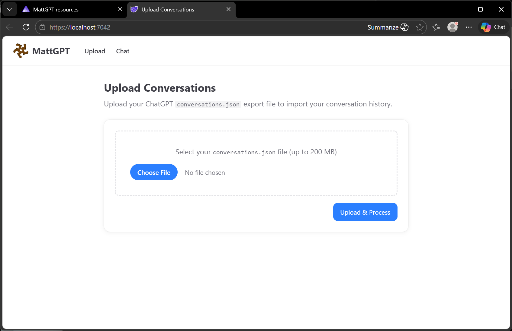

#  MattGPT

A .NET Aspire application that imports your entire ChatGPT conversation history and makes it available as RAG (Retrieval-Augmented Generation) memory for any LLM.

## Screenshots

<table>
  <tr>
    <td></td>
    <td></td>
  </tr>
  <tr>
    <td></td>
    <td></td>
  </tr>
</table>

## Goals

Enable users to import their entire ChatGPT conversation history into a format that can be used as RAG memory for any Large Language Model. This allows users to leverage their past interactions with ChatGPT to enhance responses from other LLMs.

## Solution Structure

A fully local .NET Aspire application consisting of:

- **Blazor web frontend** — upload UI and chat UI
- **ASP.NET Core API** — parsing, background processing, RAG pipeline
- **MongoDB** — stores full conversation data and metadata
- **Qdrant** — stores embeddings for semantic search
- **LLM** — config-driven: Ollama, Foundry Local, or Azure OpenAI


## Running Locally

### Prerequisites

- [.NET 10 SDK](https://dotnet.microsoft.com/download/dotnet/10.0)
- [Docker Desktop](https://www.docker.com/products/docker-desktop/) (for MongoDB and Qdrant containers)
- An LLM provider (one of):
  - [Ollama](https://ollama.com/) running locally (default)
  - [Foundry Local](https://learn.microsoft.com/windows/ai/foundry-local/) running locally
  - Azure OpenAI (cloud, requires subscription and API key)
- [Node.js](https://nodejs.org/) (for Tailwind CSS build during development)

### Setup

1. **Clone the repository**

   ```bash
   git clone https://github.com/matt-goldman/MattGPT.git
   cd MattGPT
   ```

2. **Install npm dependencies** (needed for CSS build)

   ```bash
   cd src/MattGPT.Web
   npm install
   cd ../..
   ```

3. **Configure your LLM provider** (see [LLM Configuration](#llm-configuration))

4. **Start the application**

   ```bash
   cd src/MattGPT.AppHost
   dotnet run
   ```

   Aspire will start MongoDB, Qdrant, the API service, and the web frontend automatically. The Aspire dashboard URL will be printed to the console — open it to monitor all services.

5. **Open the web UI**

   The web frontend URL is also printed on startup (e.g. `https://localhost:7xxx`). Open it in your browser.

### LLM Configuration

LLM settings are in `src/MattGPT.ApiService/appsettings.json` under the `LLM` section:

```json
{
  "LLM": {
    "Provider": "Ollama",
    "ModelId": "llama3.2",
    "EmbeddingModelId": "nomic-embed-text",
    "Endpoint": "http://localhost:11434"
  }
}
```

| Setting | Description |
|---------|-------------|
| `Provider` | LLM backend: `Ollama`, `FoundryLocal`, or `AzureOpenAI` |
| `ModelId` | Chat model name (e.g. `llama3.2` for Ollama, deployment name for Azure) |
| `EmbeddingModelId` | Embedding model name. Defaults to `ModelId` if omitted |
| `Endpoint` | Base URL of the LLM API |
| `ApiKey` | API key (required for `AzureOpenAI`; optional for `FoundryLocal`) |

**Ollama example** (default):
```json
{
  "LLM": {
    "Provider": "Ollama",
    "ModelId": "llama3.2",
    "EmbeddingModelId": "nomic-embed-text",
    "Endpoint": "http://localhost:11434"
  }
}
```

Ensure the required models are pulled before starting:
```bash
ollama pull llama3.2
ollama pull nomic-embed-text
```

**Foundry Local example**:
```json
{
  "LLM": {
    "Provider": "FoundryLocal",
    "ModelId": "phi-3.5-mini",
    "EmbeddingModelId": "phi-3.5-mini",
    "Endpoint": "http://localhost:5273/v1"
  }
}
```

**Azure OpenAI example**:
```json
{
  "LLM": {
    "Provider": "AzureOpenAI",
    "ModelId": "gpt-4o",
    "EmbeddingModelId": "text-embedding-3-small",
    "Endpoint": "https://YOUR_RESOURCE.openai.azure.com/",
    "ApiKey": "YOUR_API_KEY"
  }
}
```


## Uploading and Processing Conversations

### Exporting from ChatGPT

1. In ChatGPT, go to **Settings → Data controls → Export data**.
2. You will receive an email with a download link. Download and extract the ZIP.
3. Locate `conversations.json` inside the extracted folder. This is the file to upload.

### Upload format

- The file must be named `conversations.json` (or any `.json` file) and follow the [ChatGPT export schema](conversations.schema.json).
- Maximum file size: **200 MB** (the typical full export is ~148 MB for a large history).

### Uploading via the UI

1. Navigate to the **Upload** page from the nav bar.
2. Select your `conversations.json` file.
3. Click **Upload & Process**.

   

4. The UI will show upload progress, then switch to processing status.
5. Processing runs in the background. The UI polls for progress and shows the number of conversations processed.

   

6. When complete, a success message is shown.

### What happens during processing

The background pipeline performs the following steps automatically:

1. **Parse** — the JSON is parsed into structured conversations.
2. **Store** — each conversation is stored in MongoDB.
3. **Summarise** — each conversation is summarised using the configured LLM.
4. **Embed** — each summary is converted to a vector embedding.
5. **Index** — embeddings are stored in Qdrant for semantic search.


## Testing LLM Interaction

### Using the Chat UI

1. Navigate to the **Chat** page from the nav bar.
2. Type a question in the input box and press **Enter** or click **Send**.
3. The system embeds your query, retrieves the most semantically similar past conversations, and sends them as context to the LLM.
4. The LLM response is displayed in the chat window.
5. Below each response, click **"N source(s) used"** to expand the list of retrieved conversations that informed the response, including their titles and relevance scores.
6. Continue the conversation — each new message is processed independently with fresh RAG retrieval.


### Switching LLM providers

Update `appsettings.json` in `MattGPT.ApiService` (see [LLM Configuration](#llm-configuration)) and restart the API service. No data migration is required — embeddings are already stored in Qdrant.

> **Note:** If you change the embedding model, existing embeddings will be incompatible with new ones. Re-run the embedding pipeline via `POST /conversations/embed` on the API, or re-import your conversations.

### RAG tuning

The RAG pipeline is controlled by the `RAG` section in `appsettings.json`:

```json
{
  "RAG": {
    "TopK": 5,
    "MinScore": 0.5
  }
}
```

| Setting | Description |
|---------|-------------|
| `TopK` | Number of conversations retrieved per query (default: 5) |
| `MinScore` | Minimum cosine similarity score (0.0–1.0) to include a result (default: 0.5) |

Increase `TopK` for richer context. Lower `MinScore` to include less similar results (may add noise). Raise `MinScore` to require higher relevance.


## Troubleshooting

### Docker containers don't start

- Ensure Docker Desktop is running before starting the Aspire AppHost.
- Check the Aspire dashboard for container error logs.

### LLM is unreachable

- Navigate to `/llm/status` on the API service to check connectivity.
- For Ollama, ensure the service is running (`ollama serve`) and the required models are pulled.
- For Foundry Local, ensure the local server is started.
- Check that `Endpoint` in `appsettings.json` matches the actual running address.

### Upload fails

- Verify the file is a valid `.json` file (not the full ZIP export — extract it first).
- Files larger than 200 MB are not accepted. Split or trim the export if necessary.
- Check API service logs in the Aspire dashboard for parsing errors.

### No sources appear in chat responses

- Ensure the full pipeline has completed: upload → summarise → embed → index.
- If you imported conversations but have no embeddings, trigger the pipeline manually via the API:
  ```
  POST /conversations/summarise
  POST /conversations/embed
  ```
- Lower the `MinScore` threshold if results are being filtered out.
- Check that the embedding model is compatible with your LLM provider configuration.

### Embeddings are empty or irrelevant after switching models

- If you change `EmbeddingModelId`, existing embeddings were generated by a different model and are no longer comparable.
- Re-embed by calling `POST /conversations/embed` (the service re-embeds any conversation in the `Summarised` state).
- If needed, re-import conversations to reset processing state.


## Performance Notes

MattGPT runs LLM inference locally by default (Ollama). Performance varies **dramatically** depending on hardware:

- **GPU acceleration is strongly recommended.** On Windows with a CUDA-capable GPU, the AppHost enables GPU passthrough for the Ollama container via `.WithGPUSupport()`. This makes summarisation, embedding, and chat responses significantly faster.
- **CPU-only inference is very slow.** On macOS (or any machine without a supported GPU), expect long processing times — especially for the summarisation and embedding pipeline across thousands of conversations. The HTTP client timeout is set to 10 minutes per request to accommodate this, but individual operations may still feel sluggish.
- **Model choice matters.** Smaller models (e.g. `llama3.2` 3B, `nomic-embed-text`) are much faster than larger ones. If you're experimenting or running on limited hardware, start with the defaults.
- **Cloud providers are an alternative.** If local performance is unacceptable, switch to `AzureOpenAI` in the LLM configuration to offload inference to the cloud.

You may need to tweak the configuration for your specific hardware. The defaults are tuned for a Windows machine with an NVIDIA GPU.


## Future Enhancements

- **Runtime configuration wizard** — a guided setup experience so new users can configure the LLM provider and model without editing config files (see [issue #14](docs/TODO/014-runtime-llm-configuration-wizard.md)).
- Support for additional vector databases (Pinecone, Weaviate) and LLM endpoints.
- Advanced parsing: sentiment analysis, topic modelling, entity extraction.
- Import of other file types (images, PDFs) shared in conversations.
- Integration with LM Studio, OpenWebUI, and other LLM tools.
- Automatic project reconstruction in other LLMs from imported history.

