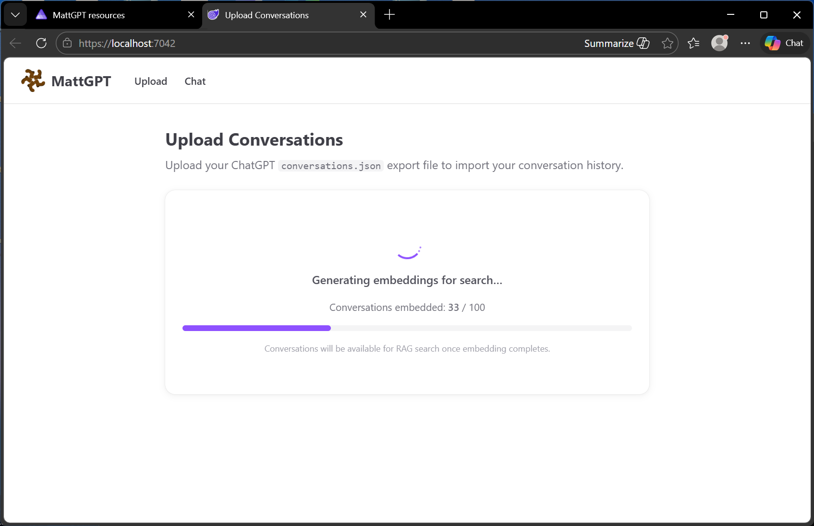
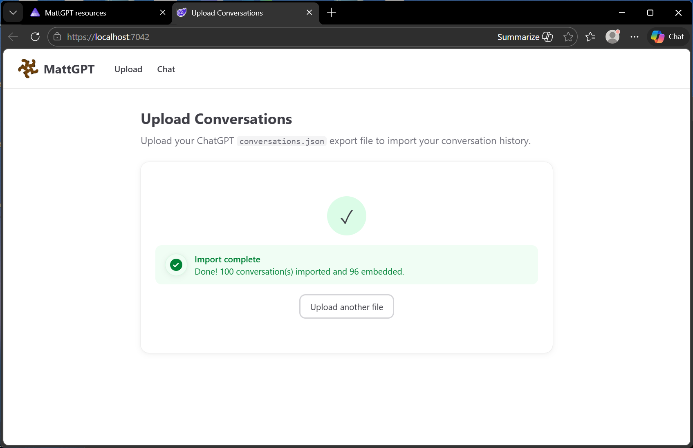
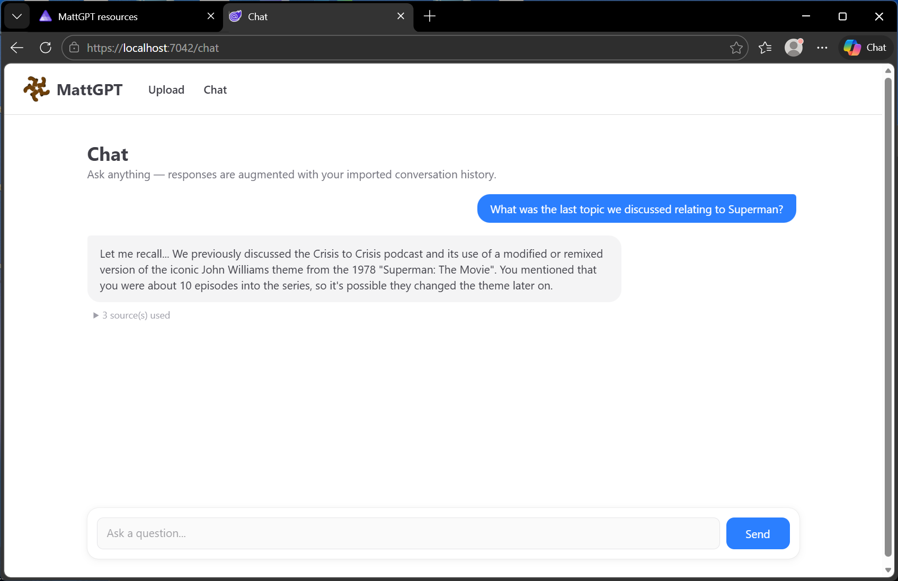

# Usage

## Exporting from ChatGPT

1. In ChatGPT, go to **Settings → Data controls → Export data**.
2. You will receive an email with a download link. Download and extract the ZIP.
3. Locate `conversations.json` inside the extracted folder. This is the file to upload.

### Upload format

- The file must be named `conversations.json` (or any `.json` file) and follow the [ChatGPT export schema](../TechnicalReference/conversations.schema.json).
- Maximum file size: **200 MB** (the typical full export is ~148 MB for a large history).
- Multi-file exports are supported — ChatGPT now splits large exports across several JSON files (e.g. `conversations-001.json`, `conversations-002.json`, etc.).

## Uploading Conversations

1. Navigate to the **Upload** page from the nav bar.
2. Select your `conversations.json` file (or multiple files for split exports).
3. Click **Upload & Process**.

   

4. The UI shows upload progress, then switches to processing status.
5. Processing runs in the background. The UI polls for progress and shows the number of conversations processed.

   

6. When complete, a success message is shown.

### What happens during processing

The background pipeline performs the following steps automatically:

1. **Parse** — the JSON is parsed into structured conversations.
2. **Store** — each conversation is stored in MongoDB.
3. **Summarise** — each conversation is summarised using the configured LLM.
4. **Embed** — each summary is converted to a vector embedding.
5. **Index** — embeddings are stored in the configured vector store for semantic search.

## Chat

### Using the Chat UI

1. Navigate to the **Chat** page from the nav bar.
2. Type a question in the input box and press **Enter** or click **Send**.
3. The system embeds your query, retrieves the most semantically similar past conversations, and sends them as context to the LLM.
4. The LLM response is displayed in the chat window.
5. Below each response, click **"N source(s) used"** to expand the list of retrieved conversations that informed the response, including their titles and relevance scores.
6. Continue the conversation — each new message is processed independently with fresh RAG retrieval.

   

### Chat history

- All chat conversations in MattGPT are saved to MongoDB and embedded in the vector store, so they become part of your searchable memory over time.
- Use the sidebar to browse and resume past sessions.
- Imported ChatGPT conversations can be viewed in a read-only viewer directly in the app.

### Conversation search

Use the search bar in the sidebar to search across all conversations (imported and native) by title or content.

## API Endpoints

The API service exposes several endpoints for programmatic access:

| Endpoint | Description |
|----------|-------------|
| `POST /conversations/upload` | Upload a conversations JSON file |
| `POST /conversations/summarise` | Trigger summarisation of unsummarised conversations |
| `POST /conversations/embed` | Trigger embedding of summarised conversations |
| `GET /conversations` | List stored conversations |
| `GET /conversations/{id}` | Get a specific conversation |
| `POST /chat` | Send a chat message (with RAG) |
| `GET /llm/status` | Check LLM connectivity |

---

← [Previous: Getting Started](getting-started.md) | [User Guides](index.md) | [Next: Configuration →](configuration.md)
