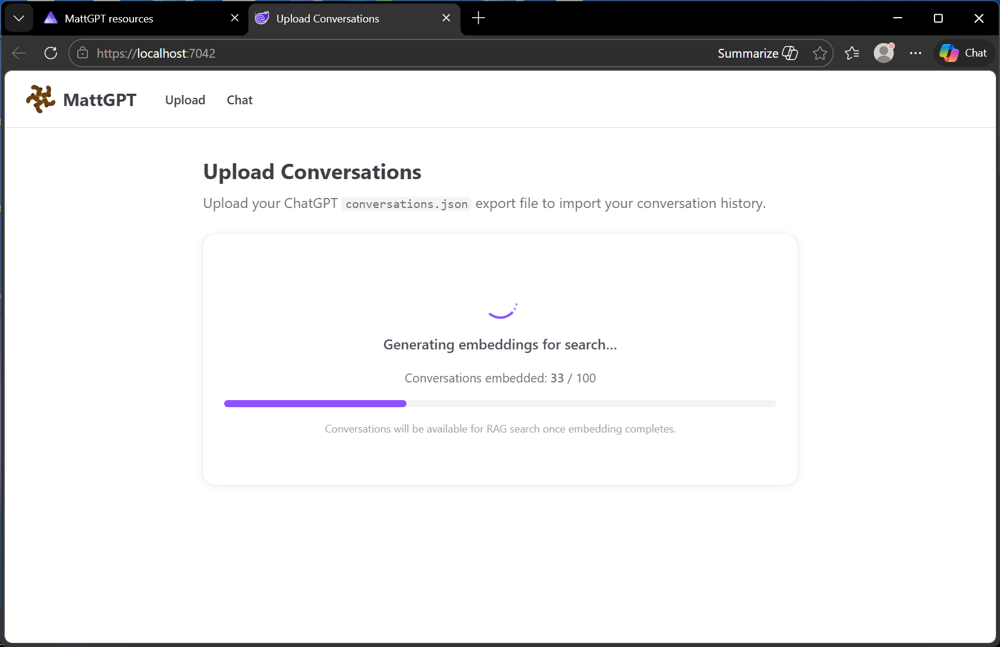
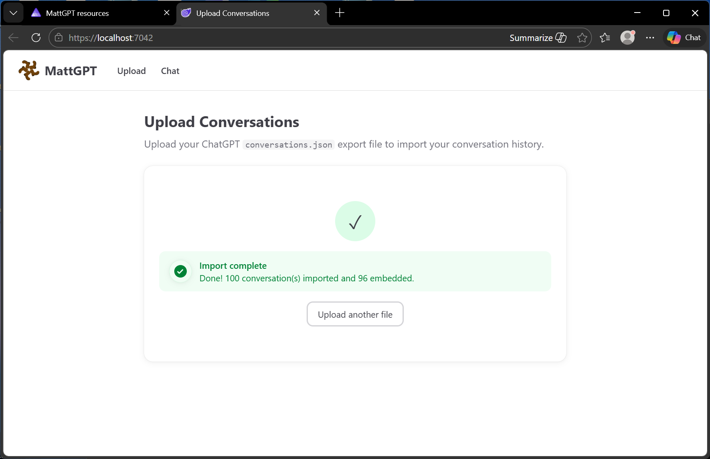
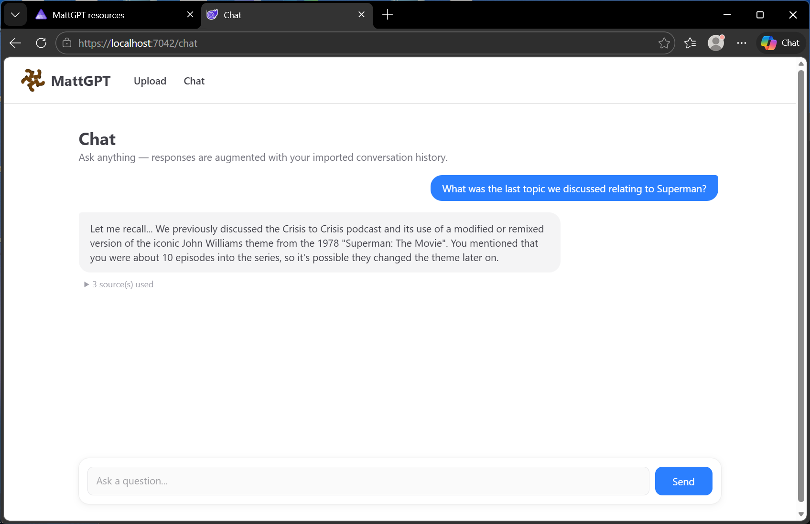

# Usage

## Exporting from ChatGPT

1. In ChatGPT, go to **Settings → Data controls → Export data**.
2. You will receive an email with a download link. Download and extract the ZIP.
3. Locate `conversations.json` inside the extracted folder. This is the file to upload.

### Upload format

- The file must be named `conversations.json` (or any `.json` file) and follow the [ChatGPT export schema](../TechnicalReference/conversations.schema.json).
- Maximum file size: **200 MB** (the typical full export is ~148 MB for a large history).
- Multi-file exports are supported — ChatGPT now splits large exports across several JSON files (e.g. `conversations-001.json`, `conversations-002.json`, etc.).

## Uploading Conversations

1. Navigate to the **Upload** page from the nav bar.
2. Select your `conversations.json` file (or multiple files for split exports).
3. Optionally tick **Generate summaries** (off by default). This writes a short digest of each conversation with the configured LLM before embedding, which can improve search. It makes one LLM call per conversation, so it can add hours to a large import. You can generate summaries later instead, from **Settings → Conversations → Generate summaries**.
4. Click **Upload & Process**.

   

5. The UI shows upload progress, then switches to processing status.
6. Processing runs in the background. The UI polls for progress and shows the number of conversations processed.

   

7. When complete, a success message is shown, and a notification appears (see [Notifications](#notifications)). It arrives even if you've left the page.

### What happens during processing

The background pipeline performs the following steps automatically:

1. **Parse**: the JSON is parsed into structured conversations.
2. **Store**: each conversation is stored in the document database.
3. **Summarise** (only with **Generate summaries**): a short digest of each conversation is generated with the configured LLM. A failure for one conversation doesn't fail the import; it can be summarised later.
4. **Embed**: each conversation's title, digest (if any) and messages are converted to a vector embedding.
5. **Index**: embeddings are stored in the configured vector store for semantic search.

## Exporting a Conversation Record

When viewing an imported conversation, click **Export record** to download a Markdown record of it: the topics discussed, decisions (including any that were later reversed), outputs and open questions.

The first time, the record is generated in the background (the button shows **Generating record…**). You'll get a notification when it's ready, and the button then downloads `<title>.md`. Records are separate from the short digests used for search, and generating one never changes search results.

## Notifications

The bell in the nav bar shows notifications for background work: imports finishing or failing, records and summaries being ready, and embedding runs. A badge counts unread notifications, and a toast appears when a new one arrives. Opening the list marks them read. Notifications are stored, so work that finishes while you're away is waiting when you come back.

## Chat

### Using the Chat UI

1. Navigate to the **Chat** page from the nav bar.
2. Type a question in the input box and press **Enter** or click **Send**.
3. The system embeds your query, retrieves the most semantically similar past conversations, and sends them as context to the LLM.
4. The LLM response is displayed in the chat window.
5. Below each response, click **"N source(s) used"** to expand the list of retrieved conversations that informed the response, including their titles and relevance scores.
6. Continue the conversation — each new message is processed independently with fresh RAG retrieval.

   

### Chat history

- All chat conversations in MattGPT are saved to the document database. When a session completes, it is summarised and embedded in the vector store, so it becomes part of your searchable memory. A session completes when you start a new chat, or after it has been idle for 30 minutes (configurable, see [Chat Settings](configuration.md#chat-settings)).
- Sources from an earlier chat session open that session, not the imported-conversation viewer.
- Use the sidebar to browse and resume past sessions.
- Imported ChatGPT conversations can be viewed in a read-only viewer directly in the app.

### Conversation search

Use the search bar in the sidebar to search across all conversations (imported and native) by title or content.

## API Endpoints

The API service exposes several endpoints for programmatic access:

| Endpoint | Description |
|----------|-------------|
| `POST /conversations/upload` | Upload a conversations JSON file |
| `POST /conversations/summarise` | Queue digest generation for every conversation without one (background; notifies when done). Each digest is embedded as it's generated |
| `POST /conversations/{id}/summarise` | Queue digest generation and re-embedding for one conversation |
| `GET /conversations/{id}/record` | Get a conversation's record: `Ready` (with the Markdown file), `Pending` or `None` |
| `POST /conversations/{id}/record` | Return the record, or queue its generation (de-duplicated) and return `Pending` |
| `POST /conversations/embed` | Trigger embedding of conversations that aren't embedded or whose digest is newer than their embedding |
| `GET /conversations` | List stored conversations |
| `GET /conversations/{id}` | Get a specific conversation |
| `GET /conversations/diagnostics` | Pipeline health, including `digestsAwaitingEmbedding` |
| `GET /notifications` | The current user's recent notifications and unread count |
| `POST /notifications/read` | Mark notifications read (`{"ids": [...]}`, or all when omitted) |
| `POST /chat` | Send a chat message (with RAG) |
| `GET /llm/status` | Check LLM connectivity |

---

← [Previous: Getting Started](getting-started.md) | [User Guides](index.md) | [Next: Configuration →](configuration.md)
